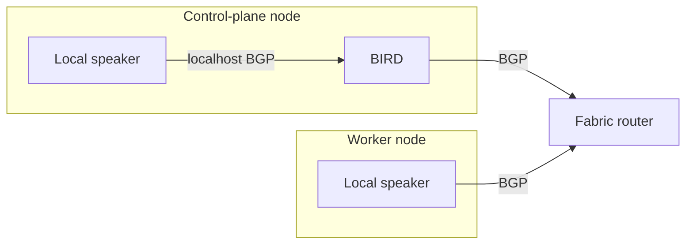

# Routed Control-Plane Endpoint

Status: proposed design.

## Summary

Katl may advertise one stable Kubernetes API address directly from every
healthy control-plane node. The network fabric routes that address to one of
the nodes advertising it. With equal-cost multipath, traffic is distributed
between healthy control-plane nodes; without it, the fabric selects one route
and reconverges when that route is withdrawn.

The operator describes a stable control-plane endpoint and the minimum BGP
facts needed to attach it to the fabric. Katl owns the host address, health
gate, route origination, BGP runtime, generated configuration, kubeadm
integration, status and withdrawal behaviour. BIRD is an implementation detail
and is not part of the user-facing configuration API.

Katl can generate named local route-exchange protocols in its BIRD instance.
This lets Cilium or another local speaker hand routes to BIRD when the operator
wants the upstream router to see one session per host. It is a convenience and
composition point, not a claim that Katl owns all routing on the node. Users may
instead attach Cilium or another daemon directly to the fabric, including with
iBGP, when their addressing and router configuration support it.

The intended explanation is:

> Every healthy control-plane node advertises the same API address. When a
> node's API server is not ready, that node stops advertising it. The routing
> fabric chooses a healthy path.

This is an opt-in node capability. An external load balancer, router-owned
endpoint or CNI-owned endpoint remains valid when the operator does not enable
advertisement.

## Motivation

A multi-control-plane kubeadm cluster needs a stable API identity for:

- kubeadm `controlPlaneEndpoint`;
- generated kubeconfigs and joining nodes;
- operator access from outside the cluster;
- CNIs such as Cilium when they cannot rely on a node-local API proxy;
- recovery and cold-start operation before Kubernetes add-ons are available.

Katl should not require L2 advertisement, ship a TCP proxy, or depend on a CNI
to create the endpoint that the CNI itself may need. A routed host address is a
small node-level capability which directly supports the kubeadm handoff.

The feature is not intended to make Katl a general routing distribution or to
own service load balancers, pod routing, Cilium policy or site-wide fabric
policy.

## Goals

1. Provide a stable Kubernetes API address before CNI installation.
2. Advertise the address only from control-plane nodes whose local API server
   is ready.
3. Withdraw safely on API failure, controller failure, daemon failure, planned
   maintenance or node loss.
4. Keep the public configuration about endpoint and fabric intent rather than
   BIRD, systemd units, interfaces or health implementation.
5. Compile the capability into Katl-owned sysext, confext, systemd-networkd,
   systemd and kubeadm artifacts.
6. Preserve the external-endpoint path for operators who own their own load
   balancer or routing configuration.
7. Leave a natural, additive place for a future OSPF advertiser without
   designing a general routing schema now.
8. Offer a generic local route-exchange attachment for operators who prefer one
   fabric-facing session per host, without making that topology mandatory.
9. Keep the canonical endpoint usable by kubeadm clients and non-Katl workers
   which do not have a Katl node-local API proxy.

## Non-goals

The first implementation does not:

- originate Kubernetes Service, pod-CIDR or other workload routes itself;
- configure Cilium or create Kubernetes API objects;
- support L2 VIP ownership;
- accept arbitrary BIRD configuration or config fragments;
- provide a generic package installation surface;
- coordinate or validate a separately managed fabric-facing routing daemon;
- expose BIRD protocol names, control sockets or generated paths as stable API;
- support BGP authentication, BFD, graceful restart, route reflection or
  per-peer policy;
- support per-node peer sets, per-node ASNs or explicit source-interface
  selection;
- apply live endpoint identity changes to an initialized cluster;
- support OSPF in the first implementation;
- generate arbitrary raw BIRD configuration.

## User-facing configuration

### Decision

`spec.controlPlaneEndpoint` becomes a structured field while the API remains
`v1alpha1`. The existing scalar is replaced instead of adding a parallel
`platformAPIEndpoint`, `loadBalancer` or `bird` field.

External endpoint:

```yaml
spec:
  controlPlaneEndpoint:
    host: api.home.example
    port: 6443
```

Katl-advertised endpoint:

```yaml
spec:
  controlPlaneEndpoint:
    host: api.home.example
    port: 6443
    advertisement:
      vip: 10.40.0.10
      bgp:
        localASN: 64512
        peers:
          - address: 10.0.0.1
            asn: 64500
```

Katl-advertised endpoint with a named local route exchange:

```yaml
spec:
  controlPlaneEndpoint:
    host: api.home.example
    port: 6443
    advertisement:
      vip: 10.40.0.10
      bgp:
        localASN: 64512
        peers:
          - address: 10.0.0.1
            asn: 64500
        routeExchange:
          - name: cilium
            exportToFabric:
              - cidr: 10.50.0.0/16
                prefixLength: 32
              - cidr: 10.60.0.0/16
                prefixLength: 24
```

`advertisement` being absent means that reachability is externally owned.
There is no `mode` or `provenance` field. The presence of a supported
advertisement block is sufficient and avoids representable contradictory
states.

The first implementation accepts exactly one `bgp` block. A future protocol
can be added as a sibling discriminated choice, for example `ospf`, with
validation requiring exactly one supported protocol. Unknown fields continue
to be rejected.

`routeExchange` stays inside this BGP attachment rather than introducing
`spec.routing`, `spec.bird` or a cluster-wide CNI section. Each list entry
declares one named, passive BGP protocol in the Katl-owned BIRD configuration.
Katl does not interpret the name, know which program connects to it, install
anything on workers, or configure the local peer. If a future design needs a
host router without a managed API endpoint, that is the point to design a
separate top-level capability rather than promoting this nested shape
accidentally.

### Field semantics

| Field | Required | Meaning |
| --- | --- | --- |
| `host` | Yes | Stable DNS name or IP literal used by kubeadm and kubeconfigs. |
| `port` | No | Kubernetes API port; defaults to `6443`. |
| `advertisement.vip` | With advertisement | One bare IPv4 address. Katl derives `/32`. CIDR notation is rejected. |
| `bgp.localASN` | With BGP | ASN used by every control-plane node for this endpoint advertiser. |
| `bgp.peers[].address` | Yes | One directly reachable IPv4 fabric peer address. Each control-plane node connects to every declared peer. |
| `bgp.peers[].asn` | Yes | ASN expected from that fabric peer. Equal to `localASN` selects iBGP; a different value selects eBGP. |
| `bgp.routeExchange[]` | No | Named passive localhost BGP protocols which may supply routes to BIRD. |
| `routeExchange[].name` | Yes | Stable DNS-label-style name used as the generated BIRD protocol identity and in status. It has no vendor semantics. |
| `routeExchange[].listenPort` | No | Local TCP port. A single entry defaults to the standard BGP port `179`; multiple entries must choose distinct ports explicitly. |
| `routeExchange[].peerASN` | No | ASN expected from the local peer; defaults to `localASN`, making the attachment iBGP. |
| `routeExchange[].exportToFabric[]` | No | Prefix envelopes controlling which routes learned from this named protocol are exported to fabric peers. Absent or empty exports none. |
| `exportToFabric[].cidr` | Yes | An IPv4 CIDR containing the routes selected for export. It is a match envelope, not a route originated by Katl. |
| `exportToFabric[].prefixLength` | No | When present, require this exact route length. When absent, accept every prefix length contained by `cidr`. |

For example, a LoadBalancer pool may permit only `/32` Service VIPs, while a
pod pool may permit only the per-node `/24` allocations. An envelope never
causes BIRD to originate its containing aggregate. It only admits a received
route which is contained by the CIDR and, when specified, has the exact stated
length. Exact lengths make common Service and pod-pool exports easy to audit.
An operator who explicitly wants every IPv4 route from the local protocol uses:

```yaml
exportToFabric:
  - cidr: 0.0.0.0/0
```

Entries are combined as a set union. Overlap is valid and exact duplicates are
normalized rather than rejected; ordering has no policy meaning.

IPv6 and dual-stack advertisement are deferred. Deferring them avoids freezing
a singular-versus-list address API before the datapath and kubeadm behaviour
have VM proof.

### Deliberately derived values

The user does not configure:

```text
routing daemon or package
sysext selection or version
dummy-interface kind, name, address prefix or MTU
which nodes advertise
BIRD router ID, protocol names, filters or control socket
source interface or source address
fabric listen port, timers, multipath or graceful-restart behaviour
import policy
health scheme, path, intervals or thresholds
start-withdrawn and withdraw-on-failure switches
certificate paths, TLS server name or status paths
systemd unit names, ordering or capabilities
```

Katl selects all and only nodes with `controlPlane: true`. The endpoint prefix
is always exactly the configured VIP. The generated endpoint BIRD instance uses
`import none` on fabric channels because Katl has no consumer for those routes.
API advertisement always starts withdrawn and is always health gated.

The preceding defaults apply when `routeExchange` is absent. For each exchange,
Katl derives the loopback peer address, passive mode and table plumbing. The
name, optional port and optional peer ASN describe the local protocol contract;
the prefix envelopes describe the operator's chosen export policy. Katl does
not infer a CNI, inspect Kubernetes objects or silently narrow an explicitly
broad envelope.

For BGP v1, Katl relies on normal kernel route selection and the daemon's local
address selection to reach each peer. The runtime records the selected source
address and router ID in status. If a peer is not directly reachable or source
selection is ambiguous, preflight fails rather than adding source-address and
interface knobs prematurely.

The generated fabric attachment directly supports the common topology in which
every control-plane node can reach the declared peers. It does not prevent the
operator from configuring additional routing processes, direct CNI peers,
per-node links or protocol redistribution outside the Katl-owned BIRD instance.
Katl reports only the portion it manages.

### Validation

Compilation rejects:

- an empty or URL-shaped `host`;
- an IP-literal `host` which does not equal the managed VIP;
- a port outside `1..65535`;
- advertisement without a VIP or BGP block;
- a VIP in CIDR notation, or an unspecified, loopback, multicast, link-local
  or otherwise unusable address;
- zero, reserved-invalid or mismatched ASNs;
- an empty peer list or duplicate peers;
- peer hostnames in the first implementation;
- duplicate route-exchange names or listen ports;
- more than one route exchange when any entry relies on the default listen
  port;
- a route exchange with an invalid name or invalid peer ASN;
- an invalid route envelope or impossible prefix length;
- managed advertisement when no control-plane node exists;
- native kubeadm input which selects a conflicting `controlPlaneEndpoint`;
- known kube-apiserver arguments or patches which prevent the API server from
  accepting traffic addressed to the VIP;
- endpoint host, port or VIP changes on a cluster recorded as initialized.

An export envelope which includes the API VIP is accepted because it is an
explicit operator routing choice. Validation emits a high-signal warning that
the VIP may then remain reachable through that route source even when Katl's
health-gated route is withdrawn. Katl reports the condition in status rather
than pretending it can guarantee exclusive ownership.

For a multi-control-plane cluster, Katl requires an explicit
`controlPlaneEndpoint`. A single-control-plane cluster may continue to default
to its bootstrap address when no endpoint is supplied.

Katl does not manage DNS. When `host` is a DNS name, bootstrap completion
requires it to resolve to the configured VIP from the `katlctl` environment and
from every node participating in bootstrap. The API certificate contains both
the host and VIP as SANs.

## Route exchange and other BGP speakers

`routeExchange` is an optional attachment, not the only supported network
topology. Its purpose is to let a local route producer use the Katl-owned BIRD
instance as its path to the declared fabric peers. A common arrangement is:



This gives an upstream router one session per control-plane host while workers,
which do not run the endpoint BIRD instance, may peer directly. It is guidance,
not enforcement. An operator may instead peer the local speaker directly from
a control-plane node, run a separate BIRD or FRR instance, use iBGP to the
fabric, or redistribute through another protocol. Katl does not inspect or
reject that configuration.

There are unavoidable host and BGP constraints which diagnostics should
explain without turning them into policy:

- two processes cannot bind the same local address and TCP port;
- an upstream router commonly identifies a neighbor by source address, so two
  direct sessions from the same node address may require separate source
  addresses and matching router configuration;
- router IDs should be unique within the relevant BGP domain;
- a route learned from one iBGP peer is not normally advertised to another
  iBGP peer because of iBGP split horizon.

The last point matters when both a local exchange and the fabric attachment use
the same ASN. BIRD can still advertise the locally originated API VIP to an
iBGP fabric peer. Transiting a route learned from a local iBGP speaker to a
second iBGP peer requires a route-reflector design or a different relationship,
such as eBGP on one side. Katl accepts the configuration and reports the actual
export state; it does not silently rewrite ASNs or enable reflection.

### Generated route-exchange protocol

For this input:

```yaml
routeExchange:
  - name: cilium
    exportToFabric:
      - cidr: 10.45.0.0/24
        prefixLength: 32
      - cidr: 172.20.0.0/16
```

Katl generates a passive BGP protocol named `cilium` with this default local
contract:

```text
address: 127.0.0.1
port: 179
local ASN: bgp.localASN
expected peer ASN: bgp.localASN
import: all IPv4 routes into the protocol's route-source table
export to local peer: none
export to fabric: union of exportToFabric envelopes
```

The protocol name remains attached to imported routes inside BIRD and appears
in status, so generated filters and diagnostics can identify their source.
Katl preserves ordinary BGP path attributes and communities. BIRD still applies
the normal next-hop and AS-path behavior of the destination fabric protocol.
Katl does not reinterpret a broad policy: `cidr: 0.0.0.0/0` without
`prefixLength` exports every IPv4 route learned from that protocol.

The optional `listenPort` and `peerASN` fields allow more than one local route
source or an eBGP local attachment without exposing BIRD syntax. The peer
address remains loopback in v1 because this capability describes a node-local
exchange. Remote route sources use ordinary fabric peers or an independently
managed routing configuration.

### Cilium example

Cilium is one consumer of this generic contract. Cilium configuration remains
in the cluster layer and is not embedded in `ClusterConfig`. Cilium supports an
active-only BGP instance with no listening port, specifically allowing it to
coexist with a router such as BIRD on the same node.

On control-plane nodes, Cilium can connect to the default exchange endpoint:

```yaml
apiVersion: cilium.io/v2
kind: CiliumBGPClusterConfig
metadata:
  name: control-plane-bgp
spec:
  nodeSelector:
    matchExpressions:
      - key: node-role.kubernetes.io/control-plane
        operator: Exists
  bgpInstances:
    - name: node-routes
      localASN: 64512
      peers:
        - name: katl-bird
          peerASN: 64512
          peerAddress: 127.0.0.1
          peerConfigRef:
            name: katl-bird
---
apiVersion: cilium.io/v2
kind: CiliumBGPPeerConfig
metadata:
  name: katl-bird
spec:
  transport:
    peerPort: 179
  families:
    - afi: ipv4
      safi: unicast
      advertisements:
        matchLabels:
          advertise: fabric
```

Workers can use a separate, disjoint `CiliumBGPClusterConfig` to peer directly
with the fabric. Both configurations may select the same
`CiliumBGPAdvertisement`, so Services can be originated from eligible
control-plane and worker nodes. For `LoadBalancerIP` and `ExternalIP`, Cilium
advertises from every selected node with `externalTrafficPolicy: Cluster` and
only from nodes with a local endpoint when it is `Local`. A withdrawal by
Cilium passes through the named exchange in the same way as a direct worker
withdrawal.

Service VIPs are `/32` by default, so an exact `/32` envelope is a useful
default. Pod route envelopes may use their allocation length or omit
`prefixLength` to accept all routes within the pod pool. Operators may also use
`0.0.0.0/0` to export everything. Katl warns, but does not reject, when that
choice includes the API VIP or other Katl-originated address space.

Cilium's router ID and any direct peering addresses remain user configuration.
Katl reports its BIRD router ID, bound ports and selected fabric source address
so the operator can detect collisions. It does not require a particular Cilium
router-ID pool or generate Cilium resources.

The public `Zariel/home-ops` configuration demonstrates the same composition
with a different upstream protocol: Cilium actively peers to a passive BIRD
protocol on `127.0.0.1:179`, and BIRD exports routes whose source protocol is
`cilium` into OSPF while leaving kernel import and export disabled. That is good
evidence that the abstraction is a named local route source, not a Cilium
feature. OSPF remains a follow-up for Katl's managed fabric attachment.

## Alternative: a node-local API relay

A KubePrism-like endpoint such as `127.0.0.1:7445` on every Katl node solves a
different problem. It gives kubelet, Cilium and other host components a stable
local address and can select among several API-server backends without putting
that local address into the network fabric. This is useful, but it is not a
replacement for the canonical routed endpoint.

| Requirement | Routed VIP | Node-local relay |
| --- | --- | --- |
| Cilium and kubelet on equipped nodes | Yes | Yes |
| Operator access from outside the cluster | Yes | No |
| kubeadm endpoint embedded in portable kubeconfigs | Yes | No |
| Katl control-plane and worker joins | Yes | Only after the relay is installed and seeded |
| Non-Katl worker joins | Yes | No, unless that worker separately installs a compatible relay |
| Requires Katl in the fabric routing domain | Yes | No |
| Works before Kubernetes add-ons | Yes | Yes, if installed as a host service |

Using localhost as kubeadm's `controlPlaneEndpoint` would make generated
kubeconfigs mean "the API proxy on this machine", not "this cluster's API".
That breaks operator kubeconfigs and non-Katl nodes, and it makes every client
responsible for installing the same local component. The canonical endpoint
therefore remains the routed DNS name and VIP. A future node-local relay may be
used additionally by host components through settings such as Cilium's
`k8sServiceHost`, just as Talos exposes KubePrism separately from the cluster's
external API identity.

IPVS is one possible relay datapath, but it is not sufficient by itself. Katl
would still need a userspace manager to install rules, probe backends, remove
unhealthy destinations, order startup and expose status. Kubernetes deprecated
kube-proxy's IPVS mode in v1.35 because the IPVS API was a poor fit for the full
Service API; that does not remove standalone IPVS from Linux, but it weakens the
case for making it a new Katl contract. A small, purpose-built TCP relay may be
easier to health-gate and operate for this single service. Either implementation
requires a separate design and should not add IPVS fields to
`controlPlaneEndpoint`.

The two capabilities can coexist cleanly:

- the routed VIP is the cluster-wide canonical identity used by kubeadm,
  operators and arbitrary Kubernetes nodes;
- the node-local relay is an optional optimization and recovery path for host
  clients on Katl nodes;
- failure of the local relay does not change fabric advertisement, and failure
  of routing does not prevent an already configured local relay from reaching
  a healthy API backend by its node address.

## Ownership model

When advertisement is enabled, Katl owns:

- the VIP on every control-plane node;
- the endpoint-advertiser sysext and its selected version;
- the complete daemon configuration and runtime instance;
- generated systemd-networkd and systemd configuration;
- the exact VIP route originated into the routing daemon;
- fabric peer sessions declared by this capability;
- health checking, advertisement transitions and status;
- integration with kubeadm bootstrap, maintenance and upgrade operations.

The operator owns:

- allocation of the VIP and DNS name;
- upstream router neighbor configuration;
- ECMP and route-selection behaviour in the fabric;
- reachability between control-plane nodes and declared peers;
- route acceptance and filtering outside the Katl node;
- CNI, Services, pod routes and site routing policy;
- local route-source configuration and the correspondence between its
  advertisements and Katl export envelopes;
- any additional routing daemons, direct CNI sessions, source addresses and
  policy outside the Katl-owned BIRD instance.

Katl does not merge raw configuration into its managed BIRD instance because it
could no longer render, validate or upgrade that instance deterministically.
This is an ownership boundary, not a host policy: an operator may run another
BIRD or FRR instance, configure Cilium directly, or use native network files as
long as its addresses, ports and process resources do not collide with the
Katl-owned instance.

The first implementation should package BIRD as part of the bounded endpoint
advertiser application rather than expose a user-selectable generic BIRD
extension. Internal packaging may reuse common bundle machinery, but there is
no public raw `bird` capability. Named route exchange is a small composition
surface for local route sources; it preserves operator-selected routes and
attributes without exposing the generated BIRD syntax.

## Data plane

Each control-plane node owns the VIP on a Katl-generated dummy interface. The
address exists before kubeadm so that the first local API server can accept
connections for it. The interface alone does not cause external advertisement.

The routing daemon has a dedicated static route source for the VIP. It starts
administratively disabled. Without local route exchange, its fabric export
rule is:

```text
accept the exact configured VIP prefix from the Katl API route source
reject everything else
```

No route is imported from a fabric peer and no route is exported to the kernel.
The kernel's local route for the dummy address handles local delivery.

With route exchange, BIRD uses distinct internal tables or channels for three
route sources:

| Source | Import | Export to fabric | Export elsewhere |
| --- | --- | --- | --- |
| Katl API route source | Exact API VIP only, while healthy | Exact API VIP | None |
| Named local BGP protocol | Import all into its source table | Routes matching that entry's `exportToFabric` union | None |
| Fabric BGP | Import none in the generated endpoint instance | Not applicable | None |

Each local session is a one-way route-source relationship even though BGP is a
bidirectional protocol: BIRD advertises no fabric or API routes back to it.
Routes and their ordinary path attributes are preserved when the selected
fabric protocol permits them. The operator owns the consequences of broad
prefix envelopes and communities which influence upstream policy.

Loss of a local exchange session removes only routes learned from that named
protocol. It does not withdraw the API VIP. Conversely, API readiness
transitions affect only the Katl API route and never withdraw routes learned
from another protocol.

When the route source is active, every established peer receives the same
`/32`. Multiple healthy control-plane nodes therefore create multiple paths to
the same address. The upstream fabric may install ECMP paths or select one best
path. Both behaviours are supported; ECMP is recommended.

The endpoint is routed anycast, not a TCP proxy. A routing change may terminate
existing connections. Kubernetes clients are expected to reconnect.

## Health and withdrawal

The controller is a host service and does not use client-go, watch
EndpointSlices or depend on Kubernetes Service state. It answers one local
question: whether this node's kube-apiserver should receive traffic.

The controller waits for kubeadm's API CA, then probes:

```text
https://<vip>:<port>/readyz
TLS server name: controlPlaneEndpoint.host
trust root: /etc/kubernetes/pki/ca.crt
```

Probing the VIP verifies local address delivery, API listening, TLS identity,
etcd-dependent API readiness and the endpoint port. A `200` response is
healthy. Probe timing and thresholds are Katl-owned constants and are not
configuration fields.

State transitions are:

```text
starting -> withdrawn
withdrawn + success threshold -> advertised
advertised + failure threshold -> withdrawn
maintenance requested -> withdrawn
controller or daemon failure -> withdrawn
```

Controller failure must fail closed. The controller's systemd unit uses an
`ExecStopPost` withdrawal helper for clean stops and unexpected process exits.
If the helper cannot confirm that the route source is disabled, it stops the
dedicated routing-daemon unit so that the fabric peer sessions fall and the
route is withdrawn. Restart always starts the route source disabled and must
pass the health threshold again. An earlier `enable` operation can therefore
never survive loss of the controller. VM tests must prove this after an
ungraceful controller termination.

The API VIP must not use BGP graceful restart or long-lived stale-route
retention. Whole-node loss is detected by loss of the BGP session. BFD may be a
future implementation option after its capabilities and interoperability are
proved; it is not a v1 user setting.

Planned kubeadm upgrade, reboot and maintenance operations explicitly withdraw
the node before stopping its API server. They wait until the local daemon
reports the route withdrawn before continuing.

## Bootstrap flow

For managed advertisement, the endpoint application is selected automatically
for control-plane nodes and activated before kubeadm:

```text
1. compile ClusterConfig into per-node generations
2. activate endpoint advertiser on every control-plane node
3. create dummy VIP and establish BGP sessions with the route withdrawn
4. run kubeadm init on the selected initial control-plane node
5. wait for the local VIP /readyz probe to succeed
6. enable the initial node's VIP route
7. verify from katlctl that the stable endpoint resolves and returns readyz
8. generate join material and join additional control-plane and worker nodes
9. each control-plane node advertises only after its own local API is ready
10. export the operator kubeconfig using the stable endpoint
11. hand off CNI and remaining cluster state to user-owned GitOps
```

The stable endpoint is written to kubeadm `ClusterConfiguration` before init.
Katl also adds the host and VIP to the apiserver certificate SANs. The selected
init node's management address remains available to `katlctl` for diagnostics
if fabric advertisement fails.

The join contract is standard kubeadm rather than a Katl-only transport. Once
the routed endpoint and ordinary kubeadm discovery credentials are available,
a non-Katl Linux worker can join using that same endpoint. It does not need the
Katl endpoint application, BIRD, the dummy interface or a localhost relay. Katl
may document and test this path, but lifecycle management of that node remains
outside Katl.

Failure to establish a peer or make the stable endpoint externally reachable
does not undo a successful `kubeadm init`. Bootstrap records the completed
mutation and stops with an explicit retry action. Rerunning the operation
rechecks local API readiness, advertiser state and external endpoint
reachability before continuing joins.

## System integration

The capability is delivered as a Katl node-application sysext selected
implicitly by `controlPlaneEndpoint.advertisement`. It contains:

- the pinned routing-daemon payload;
- the endpoint health and advertisement controller;
- bounded status helpers;
- base systemd units and extension metadata.

Generated confext contains:

- normalized internal endpoint input;
- the dummy `.netdev` and `.network` units;
- complete generated routing-daemon configuration;
- systemd drop-ins and enablement links.

The extension is active only on control-plane nodes. Workers retain the stable
endpoint in their kubeadm join configuration but do not receive the VIP,
routing daemon or endpoint application.

Native ordering must establish:

```text
confext and sysext activation
  -> systemd-networkd creates the VIP
  -> routing daemon starts withdrawn and establishes peers
  -> kubelet and kubeadm may start the local API
  -> controller health gates route origination
```

Shutdown and maintenance ordering must withdraw before kubelet terminates the
local API server.

## Status and diagnostics

Normal node status reports the product state rather than raw daemon output:

```yaml
controlPlaneEndpoint:
  endpoint: api.home.example:6443
  vip: 10.40.0.10/32
  state: advertised
  localAPIReady: true
  routeOriginated: true
  selectedSourceAddress: 10.0.0.11
  routerID: 10.0.0.11
  peers:
    - address: 10.0.0.1
      asn: 64500
      state: established
      routeExported: true
  routeExchange:
    - name: cilium
      listenAddress: 127.0.0.1
      listenPort: 179
      peerASN: 64512
      state: established
      acceptedRoutes: 3
      exportedRoutes: 3
  lastTransitionTime: 2026-07-19T12:00:00Z
```

States include:

```text
disabled
starting
waiting-for-network
waiting-for-peer
waiting-for-kubeadm-ca
waiting-for-apiserver
advertised
withdrawn
failed
```

Diagnostics may capture bounded, redacted protocol and journal information.
Raw daemon configuration, unbounded route tables and future peer secrets are
not part of normal status.

Cluster status distinguishes:

- local API readiness;
- local route origination;
- BGP session establishment and export;
- named local exchange session state and accepted/exported route counts, when
  enabled;
- stable endpoint reachability as observed by `katlctl`.

This prevents Katl from claiming the endpoint is reachable merely because the
local daemon accepted a route.

## Apply, immutability and rollback

The endpoint host, port and VIP are bootstrap-time cluster identity. After
successful `kubeadm init`, normal config apply rejects changes to those fields
and reports that a dedicated endpoint migration operation is not yet supported.

The BGP local ASN, fabric peers and named route exchanges are routing runtime
configuration rather than kubeadm identity. Normal config apply may change
them. Planning shows which sessions will reset, which exported route unions
change and whether the API route could temporarily lose all established fabric
paths. Katl validates the complete generated BIRD configuration, performs an
atomic daemon reload and retains the prior generation for rollback. It warns
about reachability loss but does not require the operator to preserve the old
topology.

Before initialization, a new generation may replace the complete endpoint
configuration. After initialization, generation rollback can restore prior BGP
and route-exchange artifacts, but it cannot claim to roll back kubeadm or
external router state.

Disabling managed advertisement on an initialized cluster is also unsupported
until a migration workflow can prove an alternative endpoint before
withdrawal.

## Security

- The generated endpoint instance imports no fabric routes because it has no
  managed consumer for them.
- A named local exchange imports routes into its isolated source table and
  exports the operator-selected union to fabric peers. `0.0.0.0/0` is a valid
  explicit selection.
- Fabric export accepts the healthy Katl-owned VIP plus routes selected by each
  exchange. Katl warns if another source can also advertise the API VIP.
- BIRD sends no routes to a local exchange peer and preserves normal BGP path
  attributes on routes exported to the fabric.
- Katl restricts its own listening sockets to their declared peers. It does not
  manage firewall or socket policy for separately operated routing daemons.
- The daemon runs with the minimum required Linux capabilities and a hardened
  systemd sandbox.
- The control socket is accessible only to root and Katl-owned services.
- No raw user routing configuration reaches the daemon.
- BGP authentication is deferred until Katl has a secret materialization and
  redaction contract.
- The health controller reads the public API CA but does not require
  `admin.conf`, a bearer token or client private key.
- Debug output does not include future authentication material or unbounded
  peer data.

## Test plan

### Unit and schema tests

- external endpoint minimal input and defaults;
- managed BGP endpoint normalization;
- strict unknown-field rejection;
- every validation failure listed above;
- derivation of control-plane-only app selection;
- kubeadm endpoint and SAN composition;
- conflicting native kubeadm input rejection;
- initialized-cluster immutability;
- named route-exchange normalization, defaulting and unique port validation;
- exact-length, any-length and `0.0.0.0/0` envelope matching;
- warning, rather than rejection, when an envelope can admit the API VIP;
- iBGP and eBGP fabric-peer normalization;
- live route-exchange and peer changes after initialization, including
  rollback to the previous generated BIRD configuration.

### Golden and host integration tests

- deterministic networkd, systemd, app and routing-daemon files;
- generated config parses with the exact packaged daemon version;
- generated units pass `systemd-analyze verify`;
- no route is imported from fabric or exported from BIRD to the kernel;
- without route exchange, the generated instance exports only the VIP;
- with route exchange, the operator-selected union crosses from each named
  local table to fabric tables and no routes cross in the reverse direction;
- BGP communities and other ordinary attributes survive route exchange;
- sysext payload contains only declared runtime files and provenance;
- workers do not receive endpoint-advertiser artifacts.

### VM tests

Use three Katl control-plane VMs, at least one worker, a fabric-router VM and an
external client namespace or VM.

Prove:

1. The VIP is absent from the fabric before kubeadm init.
2. The first node advertises only after local `/readyz` succeeds.
3. `katlctl` and `kubectl` reach the API through the stable VIP.
4. Additional control-plane nodes join through the stable endpoint and add
   equal routes only after becoming ready.
5. A worker joins through the endpoint and never advertises it.
6. Stopping one kube-apiserver withdraws only that node's route while the API
   remains reachable through another node.
7. Losing etcd readiness withdraws the affected node.
8. Killing the controller ungracefully withdraws the route.
9. Killing the routing daemon removes the fabric route.
10. Reboot starts withdrawn and does not expose the API early.
11. Planned maintenance withdraws before kubelet stops the API.
12. Peer loss and peer recovery produce bounded, accurate status.
13. A fabric with ECMP sees one path per healthy control-plane node.
14. A fabric without ECMP retains failover through normal BGP reconvergence.
15. Cilium can be installed using the stable endpoint without participating in
    its advertisement.
16. Retry after post-init fabric failure resumes without rerunning kubeadm init.
17. Cilium on a control-plane node establishes active-only iBGP to the named
    BIRD exchange while BIRD is that host's fabric path.
18. Cilium on a worker advertises the same selected Service directly to the
    fabric while BIRD is absent from that worker.
19. With `externalTrafficPolicy: Cluster`, the fabric receives the Service `/32`
    through eligible control-plane and worker paths.
20. With `externalTrafficPolicy: Local`, removing a local workload withdraws
    only that node's Service path through both attachment types.
21. An out-of-envelope local route remains unexported and is visible in bounded
    status; a `0.0.0.0/0` envelope exports routes of every IPv4 length.
22. Loss of a named local session withdraws its routes but leaves a healthy API
    VIP advertised.
23. Loss of API readiness withdraws Katl's API route but leaves valid local
    exchange routes.
24. A fabric peer whose ASN equals `localASN` receives the locally originated
    API VIP over iBGP.
25. An iBGP-to-iBGP transit attempt exposes normal split-horizon behavior in
    status and is not silently rewritten by Katl.
26. A stock, non-Katl kubeadm worker joins and uses the routed endpoint without
    BIRD or a node-local relay.

Release support requires VM proof. Unit and golden tests alone are insufficient
for a routing capability whose core value is external reachability and safe
withdrawal.

## Follow-up boundaries

Potential future additions require separate designs and proof:

- IPv6 or dual-stack endpoint addresses;
- OSPF as another bounded fabric advertiser;
- per-node peers or routed/multihop BGP attachments;
- BFD and authenticated BGP peers;
- importing fabric routes into the Katl-owned instance or exporting them to the
  kernel;
- route reflection between local and fabric iBGP peers;
- live peer migration and full endpoint migration;
- user-provided routing implementations behind a stable Katl capability
  contract.

None of these should add raw BIRD syntax to `ClusterConfig`. Katl should keep
the health-gated API route distinguishable in status even when the operator
chooses another source which can advertise the same prefix.

## Consequences

The design adds a small but real routing component to control-plane nodes. In
return, kubeadm bootstrap, CNI startup, operator access and cold recovery use
one stable endpoint whose behaviour is independent of Kubernetes add-ons.

The routed identity is also portable: non-Katl workers and external clients can
use it without installing Katl software. A node-local relay cannot provide that
property, though it remains a useful complementary capability for Katl nodes.

Katl manages only the sessions and named exchanges declared through this
feature. It does not treat other routing on the host as invalid or claim that
the managed topology is the only correct one. The declarative surface remains
smaller than raw BIRD configuration, while independently managed routing and
future proved protocol attachments remain available to the operator.

## Related documents

- [Katl North Star](https://github.com/katl-dev/katl/blob/main/docs/internal/north-star.md)
- [ClusterConfig Contract](https://github.com/katl-dev/katl/blob/main/docs/internal/cluster-manifest-contract.md)
- [Cluster Bootstrap CLI](https://github.com/katl-dev/katl/blob/main/docs/internal/cluster-bootstrap-cli.md)
- [Kubeadm Control-Plane Config Operation ADR](https://github.com/katl-dev/katl/blob/main/docs/internal/adrs/adr-010-kubeadm-control-plane-config-operation.md)
- [Kubernetes API health endpoints](https://kubernetes.io/docs/reference/using-api/health-checks/)
- [Kubeadm highly available cluster guidance](https://kubernetes.io/docs/setup/production-environment/tools/kubeadm/high-availability/)
- [BIRD user guide](https://bird.nic.cz/doc/latest/)
- [Cilium BGP Control Plane](https://docs.cilium.io/en/stable/network/bgp-control-plane/bgp-control-plane/)
- [Cilium BGP Control Plane resources](https://docs.cilium.io/en/stable/network/bgp-control-plane/bgp-control-plane-configuration/)
- [Talos KubePrism](https://docs.siderolabs.com/kubernetes-guides/advanced-guides/kubeprism)
- [Kubernetes virtual IPs and Service proxies](https://kubernetes.io/docs/reference/networking/virtual-ips/)
- [Zariel/home-ops BIRD configuration](https://github.com/Zariel/home-ops/blob/443e0920a5cdc0707037224c3481bb6b6aaf70c9/talos/manifests/bird.yaml)
- [Zariel/home-ops Cilium BGP configuration](https://github.com/Zariel/home-ops/blob/443e0920a5cdc0707037224c3481bb6b6aaf70c9/k8s/apps/kube-system/cilium/networks/bgp.yaml)
